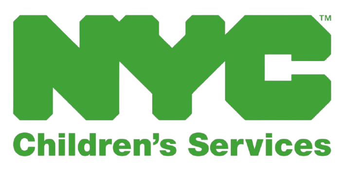

<h1 align="center">Hi, I'm Rishika! </h1>

<h3 align="center">
  
</h3>

<p align="center">
  
</p>

<p align="center">💡 <i>Passionate about leveraging AI to drive business impact and solve real-world problems.</i></p>

---

## 💼 About Me

```javascript
const rishika = {
  location: "New York, USA 🗽",
  education: ["Columbia University 🎓 | MS Data Science (Expected Dec 2026)", "Vellore Institute of Technology 🧑🏾‍🎓| B.Tech CSE & Data Science"],
  experience: ["Data Science Intern @ NYC ACS 🗽 (Summer 2026)", "Software Engineer @ Shell 🔋", "Technical Analyst @ Novartis 💊"],
  research: ["RA — Clinical LLM & Phenotyping @ Columbia Irving Medical Center 🏥", "RA — LLM Risk Modeling @ Columbia GSAS 🌍"],
  teaching: "TA — Artificial Intelligence for Public Policy @ Columbia DSI 🎓",
  skills: {
    languages: ["Python", "R", "SQL", "Java", "JavaScript", "C++", "C"],
    machineLearning: ["Regression", "Classification", "Clustering", "Feature Engineering", "Model Evaluation", "SHAP", "Explainability"],
    deepLearning: ["CNNs", "RNNs", "LSTMs", "Transfer Learning", "Computer Vision", "Sequence Modeling"],
    nlpAndGenerativeAI: ["Text Classification", "Sentiment Analysis", "Transformers", "LLMs", "Prompt Engineering", "Retrieval-Augmented Generation (RAG)", "Fine-tuning"],
    agenticAI: ["Multi-Agent Systems", "Tool Calling", "Autonomous Agents", "CrewAI"],
    frameworksAndLibraries: ["TensorFlow", "PyTorch", "scikit-learn", "Keras", "Hugging Face"],
    dataAndAnalytics: ["Pandas", "NumPy", "Apache Spark", "Databricks", "Alteryx"],
    visualization: ["Tableau", "Power BI", "Qlik Sense", "Matplotlib", "Seaborn", "Plotly"],
    mlopsAndDeployment: ["Git", "GitHub", "Docker", "Kubernetes", "MLflow", "AWS", "GCP", "Streamlit", "FastAPI", "Flask"]
  },
 interests: ["Deep Learning", "Natural Language Processing", "Computer Vision", "Generative AI", "Agentic AI"],
};

```

---

## 👩🏻‍💻 Tech Stack

### Languages


### ML/AI Frameworks


### Data Science & Visualization


### Cloud & Big Data


### Development Tools


### Web Technologies


---

## 🔬 Research Experience

### 🏥 Columbia University, Irving Medical Center | Research Assistant — Clinical LLM & Phenotyping
**Jan 2026 - Present** | 📍 New York, NY

> **Project:** Automated phenotype extraction for a **118-patient cardiac sarcoidosis cohort** under IRB AAAV0341 (NYP/CUMC, data cutoff 1 Jul 2024), transforming **50,486 unstructured Epic cardiology progress notes + 153 rheumatology consults** into a structured 56-field clinical dataset for downstream phenotyping and outcome modeling.

```python
pipeline = {
    "Note_Reconstruction":   "Grouped multi-row Epic fragments by (EMPI, NOTE_CSN_ID) and concatenated in row order — fixed systematic truncation present in prior v3 pipeline",
    "Temporal_Structure":    "Per-patient visit-level delimiters (=== CARDIOLOGY NOTE YYYY-MM-DD ===) preserve serial reasoning over LVEF trends and multi-year medication histories; explicit [NO RHEUMATOLOGY NOTE] marker for 110/118 patients to signal absence rather than omission",
    "De_identification":     "Two-pass redaction — regex on Epic headers (Patient Name:, DOB:, MRN:) with Title-Case requirement + 30-token stoplist → GPT-4.1-mini fallback (temp 0, JSON-constrained) for 51/118 names (43%) + 64/118 DOBs (54%) + hospital MRNs distinct from EMPI; opaque per-patient [NAME_<EMPI>] placeholders with PHI map held in volatile memory only",
    "Extraction_Model":      "GPT-4.1 via OpenAI API under Columbia IT HIPAA-compliant protocols, temperature 0, response_format=json_object for guaranteed parsable output",
    "Schema":                "56 structured fields — demographics, cardiac symptoms, device history, extra-cardiac sarcoidosis manifestations, cardiovascular comorbidities, serial ECG / echocardiography / cardiac MRI / FDG PET-CT findings, histopathology, lab markers (ACE, lysozyme, IL-2R, vit-D, troponin, BNP), immunosuppressive & DMARD therapy with start/stop timestamps",
    "Anti_Hallucination":    "4 system-prompt directives: extract only explicitly stated info; never infer plausible values from context; return Unknown (categorical) / null (numeric) for absent fields; mark rheumatology-specific fields Unknown when the absence marker is present rather than back-inferring from cardiology",
    "Long_Context_Handling": "Two-pass extraction for 23 patients exceeding 120k tokens (tiktoken o200k_base) with field-aware merge — first-non-Unknown for demographics, semicolon-delimited dedup for time-series labs, pipe-joined informative-preferred for categoricals",
    "Reliability":           "Adaptive max_tokens (8k → 16k on finish_reason='length'), exponential backoff on transient API errors, cross-patient contamination scan (0 events across all 118 patients)",
    "Output":                "3-sheet Excel — re-identified structured extraction (118 × 56 fields + PHI + note counts + date ranges), per-patient de-identification audit (regex vs LLM substitution source), cross-patient contamination log",
    "Validation":            "Random sample of 10 patients independently chart-reviewed by 2 clinicians (M.S.G., M.O.A.) against source Epic notes; discrepancies classified as omissions / commissions / value errors / temporal errors with per-field and per-domain agreement rates",
    "Stack":                 "Python 3.11, pandas, openai, tiktoken (o200k_base), tqdm, openpyxl"
}
```

### 🌍 Columbia University, Graduate School of Arts and Sciences | Research Assistant — Human Rights LLM Evaluation
**Jan 2026 - Present** | 📍 New York, NY

> **Project:** Automated **Human Rights Due Diligence (HRDD) scoring framework** for **27 defense manufacturers**, grounded in UN Guiding Principles, UNICEF CRBP, ABA Defense Industry HRDD Guidance, UN Six Grave Violations framework, and Arms Trade Treaty Article 7.4 — **reducing manual review effort by 80%** while preserving full evidence auditability and statistical validation against human raters.

```python
pipeline = {
    "Framework":             "UN Guiding Principles on Business & Human Rights (Principles 15-24) + UNICEF Children's Rights and Business Principles (2012) + ABA Defense Industry HRDD Guidance + UN Six Grave Violations Against Children in Armed Conflict + Arms Trade Treaty Article 7.4",
    "Main_HRDD_Dimensions":  "5 lifecycle dimensions — Policy Commitment (UNGP 2.15-16), Risk Assessment (BAR contextual/client risk + UNGP 2.17-18), Prevention & Mitigation (BAR termination clauses + training + red-flag systems + UNGP 2.19), End-Use Monitoring (BAR periodic audits/site inspections + UNGP 2.20), Investigation & Remediation (BAR misuse investigation + UNGP 2.22-24)",
    "Child_Rights_Subdims":  "4 CRBP / Six-Violations sub-dimensions — Child Rights Policy Commitment (senior-level CRC/CRBP/ILO 182 references), Child Rights Risk Assessment (dedicated VAC records + child soldier recruitment history + attacks on schools/hospitals), Violation Prevention (child-conscious product design + termination clauses), Monitoring & Reporting (end-use monitoring with child impact indicators + accessible grievance mechanisms)",
    "Rubric":                "0 = absent · 1 = vague · 2 = clear policy with limited mechanisms · 3 = comprehensive with mechanisms and accountability",
    "Stage_1_Research":      "Claude Haiku with web_search tool extracts direct verbatim quotes from each company's Code of Conduct, Human Rights Policy, Sustainability Reports, Export Control Policies, Supplier Codes, and Modern Slavery Statements (with source URLs) when spreadsheet Table 2.0 evidence < 3,000 chars; research model required to output 'NOT FOUND' rather than fabricate",
    "Stage_2_Scoring":       "Claude Sonnet scores each dimension via chain-of-thought reasoning — quotes specific evidence, maps to rubric anchor, assigns score; research and scoring kept in separate API calls so the scorer cannot fabricate evidence; Research Audit sheet preserves all source URLs for manual verification",
    "Human_Baseline":        "12 previously human-rated companies re-scored — Lockheed Martin, Raytheon/RTX, Northrop Grumman, Boeing, General Dynamics, BAE Systems, NORINCO, AVIC, CASC, Rostec, CETC, Leonardo; original 10-dim human scores mapped to new 5-dim framework via averaged constituent dimensions",
    "Inter_Rater_Reliability": "Cohen's Weighted Kappa (linear + quadratic) for ordinal chance-corrected agreement, Krippendorff's Alpha for ordinal data, Spearman rank correlation for company ordering, per-dimension MAE, exact-match & within-±1 agreement percentages, full confusion matrix of score-level disagreements",
    "Output":                "5-sheet styled Excel — Claude_Scores (color-coded 0-3 heatmap across 27 companies), Human_vs_Claude (side-by-side with green/red diff highlighting), Evaluation (full IRR metrics), Reasoning (chain-of-thought justification for every score), Research_Audit (web sources for sparse-evidence companies)",
    "Rate_Limit_Handling":   "Anthropic API 10,000 tokens/min constraint handled via 65-second inter-call sleeps + exponential backoff retries"
}
```

---

## 🎓 Teaching Experience

### 📚 Columbia University, Data Science Institute | Teaching Assistant
**Sep 2025 - Present** | 📍 New York, NY

```python
teaching = {
    "course": "Artificial Intelligence for Public Policy",
    "responsibilities": [
        "Grading assignments & exams",
        "Office hours & student mentorship",
        "Curriculum support on AI ethics, governance, and policy applications"
    ]
}
```

---

## 🤝 Volunteer Experience

### 🏛️ Columbia University, Data Science Institute | Student Council — Communications & Professional Resources
**Sep 2025 - Present** | 📍 New York, NY

```python
council = {
    "role": "Communications & Professional Resources",
    "responsibilities": [
        "Curate and disseminate career resources, internship opportunities, and industry events for the Columbia MSDS community",
        "Coordinate communications between students, faculty, and external partners",
        "Design and ship technical tools that improve the student experience end-to-end"
    ],
    "flagship_build": {
        "project":     "DSI Course Evaluation Website",
        "link":        "https://github.com/rishika1099/DSI-Course-Evaluation-Website",
        "description": "Student dashboard for Columbia MSDS course reviews — pulls live form responses from Google Sheets, surfaces personalized course rankings, AI-summarized review deep-dives, and what-to-take-next recommendations for incoming and continuing students",
        "stack":       ["Python", "Google Sheets API", "LLMs"]
    }
}
```

---

## 💼 Professional Journey

###  NYC Administration for Children's Services | Data Science Intern
**Jun 2026 - Aug 2026** | 📍 New York, NY

```python
achievements = {
    "Child_Welfare_Risk_Modeling": {
        "description": "Developing predictive risk models on child welfare administrative data with explainable ML, fairness auditing, and causal adjustment",
        "tools": ["Python", "scikit-learn", "SQL", "NCANDS data"],
        "result": "Transparent decision-making support in a high-stakes public-sector setting 📈"
    }
}
```

###  Shell | Software Engineer
**Aug 2023 - Jul 2025** | 📍 Bengaluru, India

```python
achievements = {
    "Financial_Forecasting": {
        "description": "Gradient-boosted regression models in Databricks (PySpark, SQL) for financial forecasting across 12 business units",
        "tools": ["Databricks", "PySpark", "Power BI", "Power Apps"],
        "result": "Reduced forecast error by 23%; supported $100K+ annual cost optimization 💰"
    },
    "RPA_Automation": {
        "description": "Production ETL pipelines & 5 Blue Prism RPA bots with logging, retry logic, and exception handling",
        "tools": ["Blue Prism", "Python", "Selenium"],
        "result": "Reduced manual reporting effort by 85% (120+ hrs/quarter); SLA compliance from 92% to 99% ⏱️"
    }
}
```

###  Novartis | Technical Analyst Intern
**Jan 2023 - Jul 2023** | 📍 Hyderabad, India

```python
achievements = {
    "Net_Zero_Emissions": {
        "description": "Predictive modeling on environmental data for emissions reduction",
        "tools": ["Python", "scikit-learn", "Alteryx", "Qlik Sense"],
        "result": "19% reduction in carbon emissions 🌱"
    },
    "NLP_Clinical_Trials": {
        "description": "TF-IDF, NER, and text classification over clinical trial documentation",
        "tools": ["Python", "NLP"],
        "result": "40% reduction in manual review time per quarter 📊"
    }
}
```

### 📲 Saint Louis University | Data Visualization Intern
**Feb 2022 - Mar 2022**

```python
achievements = {
    "Campaign_Data_Analysis": {
        "description": "Tableau dashboards analyzing campaign performance metrics",
        "tools": ["Python", "Tableau"],
        "result": "Enhanced campaign efficiency & optimized resource allocation 📈"
    }
}
```

---

## 🚀 Projects

### 🏥 Healthcare & Medical AI

| Project | Description | Tech Stack |
|---------|-------------|------------|
| [Folio-Clinical-Multimodal-RAG](https://github.com/rishika1099/Folio-Clinical-Multimodal-RAG) | Multimodal medical record companion with PDF, photo, voice, and text ingestion; five-stage extraction pipeline (ingest → extract → validate → score → persist); consensus extraction using embedding-cluster voting across multiple LLMs; longitudinal context injection from the last 3 reports; 6 evaluation metrics (extraction completeness, diagnosis confidence, hallucination risk, ICD-10 validity, longitudinal consistency, severity trend). **85.1% extraction micro-F1, 100% RAG recall@1, sub-2s median latency** | FastAPI, MongoDB, Redis, React, Vite, Claude API |
| [Colon-Cancer-Trial-Causal-Analysis](https://github.com/rishika1099/Colon-Cancer-Trial-Causal-Analysis) | Causal-inference re-analysis of the Moertel 1990 adjuvant colon cancer trial (n=929). Five nested estimands: ATE estimation, backdoor adjustment with a bad-control demonstration, heterogeneous treatment effects (CATE), mediation analysis, and transportability. Demonstrates collider bias reversing treatment direction (HR 0.69 → 1.10) | Python, lifelines, statsmodels, EconML |
| [Kidney-Disorder-Detection](https://github.com/rishika1099/Kidney-Disorder-Detection) | Deep learning system classifying CT scans with **99.2% accuracy** | TensorFlow, VGG19, ResNet50 |
| [Medical-Image-Analysis-Assistant](https://github.com/rishika1099/Medical-Image-Analysis-Assistant) | AI-powered medical image analysis using Google Gemini Vision | Gemini, Streamlit |
| [Cataract-Detection](https://github.com/rishika1099/Cataract-Detection) | CNN & Transfer Learning for automated cataract detection | TensorFlow, CNN |
| [Keratoconus-Detection](https://github.com/rishika1099/Keratoconus-Detection) | SVM & Deep Neural Networks for keratoconus detection | SVM, DNN |
| [Heart-Disease-Prediction](https://github.com/rishika1099/Heart-Disease-Prediction) | ML with EDA, SMOTE & hyperparameter tuning | scikit-learn, SMOTE |
| [Diabetes-Risk-Prediction](https://github.com/rishika1099/Diabetes-Risk-Prediction) | Gradient Boosting with SHAP explainability | XGBoost, SHAP |
| [Colorectal-Cancer-Risk-Analysis](https://github.com/rishika1099/Colorectal-Cancer-Risk-Analysis) | Visual analysis of diet/lifestyle factors in CRC risk | R, ggplot2 |

### 🤖 NLP & Generative AI

| Project | Description | Tech Stack |
|---------|-------------|------------|
| [Federal-Eagle-AI-Legal-Assistant](https://github.com/rishika1099/Federal-Eagle-AI-Legal-Assistant) | Multi-agent CrewAI system for U.S. federal legal analysis with semantic retrieval over all 54 U.S. Code titles, precedent search, elements analysis, and draft generation. **87% precision@5** on benchmark queries | CrewAI, LangChain, ChromaDB, Streamlit |
| [Just-Ask-Coach-Query-SQL-Translation](https://github.com/rishika1099/Just-Ask-Coach-Query-SQL-Translation) | Natural language → SQL → visualization pipeline for sports performance analytics. ChromaDB semantic retrieval over 10 KPI definitions feeds a five-prompt Claude pipeline (intent classification, SQL generation, AST-based safety validation, self-verification, chart + follow-up suggestion). **80% pass rate** on 15-question benchmark with parallelized async orchestration | FastAPI, SQLite, ChromaDB, Claude (Sonnet + Haiku), React, Vite |
| [Prescibed-Motion-Exercise-Recommendation-LLM](https://github.com/rishika1099/Prescibed-Motion-Exercise-Recommendation-LLM) | AI coaching system mapping natural language fitness queries to personalized exercise recommendations. Two-stage retrieval (PostgreSQL FTS + trigram) over 100k+ exercises; Claude tool-use re-ranking against intent (rehab / performance / strength / mobility / conditioning) with body-part, intensity, and equipment constraints; MD5 query cache; graceful retrieval fallback | FastAPI, PostgreSQL, Supabase, Claude, Fly.io, Netlify |
| [Ruchi-Pantry-to-Plate-Intelligence-Platform](https://github.com/rishika1099/Ruchi-Pantry-to-Plate-Intelligence-Platform) | AI-powered food web app with three pillars: video-to-recipe extraction, pantry-to-plate matching with nutrition & allergen data, and personalised health coaching with calorie tracking, smart ingredient swaps, and adaptive meal plans. Integrates Instacart, Apple Health, and social video share sheets | React, Vite, Framer Motion, OpenAI, Serverless |
| [Reel-Chef-Video-To-Recipie-Extractor](https://github.com/rishika1099/Reel-Chef-Video-To-Recipie-Extractor) | Multi-stage vision-language pipeline converting cooking videos into structured recipes. Combines frame extraction, visual scene understanding, and LLM-based reasoning to transform raw video into ingredient lists, step-by-step instructions, and estimated cook times | Python, Computer Vision, LLMs |
| [Hey-Swiftie-Cluster-Emotion-Verse](https://github.com/rishika1099/Hey-Swiftie-Cluster-Emotion-Verse) | AI diary that converts journal entries into personalized verses and music recommendations. DistilRoBERTa emotion classification over diary text + K-Means clustering across 867 Taylor Swift songs on lyric embeddings and audio features; RAG layer matches diary mood to closest thematic cluster and returns ranked song recommendations | Python, DistilRoBERTa, K-Means, OpenAI, React, RAG |
| [DSI-Course-Evaluation-Website](https://github.com/rishika1099/DSI-Course-Evaluation-Website) | Student dashboard for Columbia MSDS course reviews. Pulls live form responses from Google Sheets and surfaces personalized course rankings, deep dives with AI-summarized reviews, and recommendations for what to take next | Python, Google Sheets API, LLMs |
| [AI-Blog-Assistant](https://github.com/rishika1099/AI-Blog-Assistant) | GPT-4 blog generator with DALL-E images & SEO optimization | OpenAI, Streamlit |
| [Analogy-Tutor](https://github.com/rishika1099/Analogy-Tutor) | Explains technical concepts via personalized analogies | OpenAI, Streamlit |
| [Fake-News-Detection](https://github.com/rishika1099/Fake-News-Detection) | TF-IDF + Linear SVM for news credibility prediction | TF-IDF, SVM |

### ⚡ Systems & High-Performance ML

| Project | Description | Tech Stack |
|---------|-------------|------------|
| [KV-Cache-Implementation](https://github.com/rishika1099/KV-Cache-Implementation) | Controlled single-codebase benchmark of five KV-cache optimization techniques on Llama-2-7B: KIVI 2/4-bit quantization, TopK sparse selection, SnapKV one-shot eviction, TransMLA latent projection, and a KIVI×TopK hybrid. Unified runner shares model, tokenizer, decode loop, seeds, and hardware. Evaluated on LongBench + synthetic throughput sweeps. **KIVI 4-bit: 1.93× decode throughput at BS=32, lossless LongBench quality (0.292 vs 0.291), 3.1× peak throughput at max batch capacity** | PyTorch, HuggingFace Transformers, Triton, Modal, W&B |

### 🖼️ Computer Vision

| Project | Description | Tech Stack |
|---------|-------------|------------|
| [Traffic-Sign-Classifier](https://github.com/rishika1099/Traffic-Sign-Classifier) | VGG16 transfer learning, **98% accuracy** on GTSRB | TensorFlow, VGG16 |
| [Plant-Disease-Detection](https://github.com/rishika1099/Plant-Disease-Detection) | ResNet50 transfer learning on 38 plant disease classes | TensorFlow, ResNet50 |

### 🔒 CyberSecurity 

| Project | Description | Tech Stack |
|---------|-------------|------------|
| [Android-Malware-Analysis](https://github.com/rishika1099/Android-Malware-Analysis) | Deep learning malware detection with **98% accuracy** | Python, Deep Learning |
| [Blockchain-Secure-Data-Storage](https://github.com/rishika1099/Blockchain-Secure-Data-Storage) | ECDSA signatures & Proof of Work for encrypted medical data | Blockchain, ECDSA |

### 📊 Predictive Analytics

| Project | Description | Tech Stack |
|---------|-------------|------------|
| [Safe-Start-NCANDS-Child-Welfare-Prediction](https://github.com/rishika1099/Safe-Start-NCANDS-Child-Welfare-Prediction) | ML and predictive analytics framework for identifying high-risk child welfare cases using NCANDS administrative data. Risk-factor discovery with explainable models and fairness auditing to support transparent decision-making | Python, scikit-learn, SHAP, Jupyter |
| [Car-Price-Prediction](https://github.com/rishika1099/Car-Price-Prediction) | Ensemble methods with SHAP explainability | XGBoost, SHAP |
| [House-Price-Prediction](https://github.com/rishika1099/House-Price-Prediction) | XGBoost regression on California housing data | XGBoost, Streamlit |
| [Loan-Status-Prediction](https://github.com/rishika1099/Loan-Status-Prediction) | Gradient Boosting classifier with SHAP explanations | XGBoost, SHAP |
| [Red-Wine-Quality-Prediction](https://github.com/rishika1099/Red-Wine-Quality-Prediction) | Gradient Boosting regression with feature importance | XGBoost, SHAP |
| [Customer-Churn-Prediction](https://github.com/rishika1099/Customer-Churn-Prediction) | Predicting repeat purchase behavior for food delivery | scikit-learn |
| [Rock-Mine-Prediction](https://github.com/rishika1099/Rock-Mine-Prediction) | Sonar signal classification comparing multiple ML models | scikit-learn |


---

## 🎓 Education

### Columbia University | MS in Data Science
**Expected Dec 2026 | New York, US**

**📚 Coursework**

| Term | Courses |
|------|---------|
| **Fall 2026** | Agentic AI |
| **Spring 2026** | Causal Inference · High Performance Machine Learning · Machine Learning · Statistical Inference and Modelling |
| **Fall 2025** | Applied Deep Learning · LLM-based Generative AI Systems · Exploratory Data Analysis and Visualization · Probability and Statistics |

- 🧑‍🏫 **Teaching Assistant** for Artificial Intelligence for Public Policy
- 🔬 **Research Assistant** at Columbia Irving Medical Center & Columbia GSAS
- 🏛️ Data Science Institute Student Council — **Communications & Professional Resources**

### Vellore Institute of Technology | B.Tech Computer Science - Data Science
**May 2023 | Vellore, IN | CGPA: 4.0/4.0**
- 🏆 Rank: **7/~200** (Top 4%)
- 🎖️ Recipient of **Merit Scholarship 2019-2023**
- 👥 Program Representative 2019-2023

<details>
<summary>📚 <b>Coursework</b></summary>

| Math | Computer Science | Data Science |
|------|------------------|--------------|
| Calculus for Engineers | Problem Solving and Programming | Artificial Intelligence |
| Applied Linear Algebra | Advanced C Programming | Machine Learning |
| Discrete Mathematics and Graph Theory | Java Programming | Deep Learning |
| Statistics for Engineers | Data Structures and Algorithms | Natural Language Processing |
| Business Mathematics | Object-Oriented Programming | Image Processing |
| Applications of Differential and Difference Equation | Database Management Systems | Predictive Analytics |
| | Operating Systems | Mathematical Modeling for Data Science |
| | Computer Architecture and Organization | Programming for Data Science |
| | Digital Logic and Design | Business Intelligence and Analytics |
| | Theory of Computation and Compiler Design | Social and Information Network |
| | Network and Communication | |
| | Internet Programming and Web Technologies | |
| | Internet of Things | |
| | Cryptography and Network Security | |
| | Information Security Analysis and Audit | |
| | Information Security Management | |
| | Blockchain and Cryptocurrency Technology | |
| | Electrical and Electronics Engineering | |

</details>

---

## 🌐 Connect with Me!

<p align="center">
  <a href="https://www.linkedin.com/in/rishika-mamidibathula/">
    
  </a>
  <a href="mailto:rm4318@columbia.edu">
    
  </a>
  <a href="https://github.com/rishika1099">
    
  </a>
  <a href="https://huggingface.co/rm4318">
    
  </a>
</p>

---

### 📄 Looking to hire? 

> **[View My Resume](https://drive.google.com/file/d/1OV4F-y6g2cZ0j73z1eazNDwSea01r5L4/view?usp=sharing)** 📥

📌 *Currently seeking **full-time roles starting in 2027** following graduation.*


---

